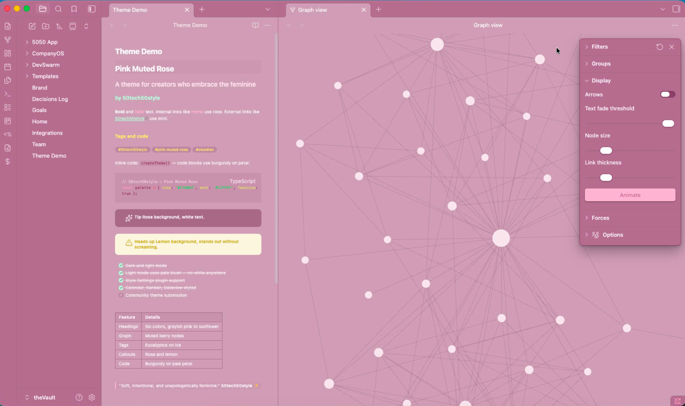

# Pink Muted Rose

A theme for creators who embrace the feminine.

## Light mode

## Dark mode

## Features

- **Dark mode** — muted rose palette, no pure black
- **Light mode** — pale blush tint, no white anywhere
- **Style Settings support** — customize heading colors, fonts, accents, and more
- **Plugin compatibility** — styled for Calendar, Kanban, and Dataview
- **Custom callouts** — rose and lemon backgrounds, rounded corners
- **Eucalyptus tags** — green on ice pill styling
- **Six heading colors** — grayish pink through sunflower
- **Burgundy code** — deep rose on pale petal backgrounds

## Installation

1. Open Obsidian → Settings → Appearance → Themes
2. Click **Manage** and search for **Pink Muted Rose**
3. Click **Install** then **Use**

## Style Settings

Install the [Style Settings](https://github.com/mgmeyers/obsidian-style-settings) plugin to customize:

- All six heading colors
- Body and monospace fonts
- Font size and line height
- Content width
- Primary, secondary, and highlight accent colors
- Tag style (pill, square, or minimal)
- Rainbow folder icons

## Credits

Fork of [Fairyfloss](http://sailorhg.github.io/fairyfloss/) by [sailorhg](https://github.com/sailorhg), adapted for VS Code by [nopjmp](https://github.com/nopjmp/vscode-fairyfloss), ported to Obsidian by [50tech50style](https://github.com/50tech50style).

## License

MIT © 50tech50style
